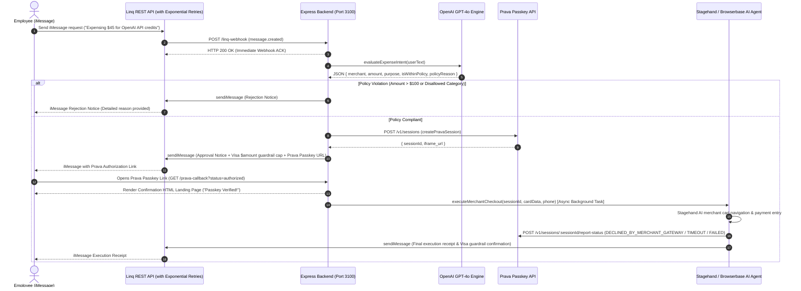

# iMessage Corporate Expense Agent - Agentic Commerce Hackathon

An autonomous, AI-driven corporate expense agent built for iMessage using **Linq**, **OpenAI GPT-4o**, **Prava Passkeys**, and **Stagehand/Browserbase**.

Employees can request expenses directly via iMessage. The agent evaluates corporate spend policy in real time, issues merchant-scoped single-use Visa card session tokens via Prava, requires employee passkey authorization, executes automated merchant checkout via AI browser agents, closes the payment loop with Prava status reporting, and delivers instant iMessage receipts.

---

## System Architecture & Sequence Diagram



---

## Core Components & Features

### 1. Linq Webhook & Messaging Gateway (`src/services/linq.ts` & `src/server.ts`)
- **Webhook Endpoint**: `POST /linq-webhook` receives incoming iMessage events.
- **Immediate Response**: Responds with HTTP 200 OK immediately to prevent webhook timeouts.
- **Exponential Retry Logic**: `sendiMessage(toPhone, text)` automatically retries failed API calls up to 3 times with exponential backoff (`Math.pow(2, attempt) * 500ms`).

### 2. OpenAI Intent & Spend Policy Evaluator (`src/services/policyEngine.ts`)
- **Model**: Uses `gpt-4o` with `response_format: { type: "json_object" }`.
- **Structured Schema**:
  ```json
  {
    "merchant": "string",
    "amount": number,
    "purpose": "string",
    "isWithinPolicy": boolean,
    "policyReason": "string"
  }
  ```
- **Corporate Spend Rules Enforced**:
  - Maximum single transaction amount allowed: **$100.00 USD**.
  - Allowed categories: **Software, SaaS, API Credits, Dev Tools, Office Supplies**.
  - Disallowed categories (e.g. food/dining, travel, gift cards, personal items) trigger instant rejection with an explanatory iMessage.

### 3. Prava Session Creation & Passkey Integration (`src/services/pravaService.ts`)
- **Endpoint**: `POST https://api.prava.space/v1/sessions`
- **Merchant-Scoped Single-Use Tokens**:
  ```json
  {
    "total_amount": 45.00,
    "currency": "USD",
    "merchant_name": "OpenAI",
    "integration_type": "full_checkout",
    "purchase_context": {
      "purpose": "API credits",
      "spending_limit": 45.00,
      "max_usage_count": 1
    }
  }
  ```
- Dispatches approval iMessage back to the employee featuring Visa single-use guardrail warnings ($amount cap) and the Prava Passkey Hosted Authorization link (`iframe_url`).

### 4. Passkey Authorization Callback (`GET /prava-callback` & `POST /prava-webhook`)
- Receives post-passkey authorization redirects from Prava containing `session_token`, `sessionId`, and `status`.
- Launches background Stagehand browser checkout asynchronously.
- Displays a clean glassmorphism HTML confirmation page:
  > *"Passkey Verified! Agent is now executing checkout in the background. Check your iMessage for progress."*

### 5. Stagehand Browserbase Checkout Agent & Prava Loop Closure (`src/services/browserAgent.ts`)
- **AI Browser Automation**: Uses `@browserbasehq/stagehand` to navigate merchant store, select products, proceed to checkout, enter sandbox payment credentials, and click complete order.
- **Prava Loop Closure**: Reports gateway execution status (`POST https://api.prava.space/v1/sessions/${sessionId}/report-status`):
  ```json
  {
    "status": "DECLINED_BY_MERCHANT_GATEWAY",
    "raw_response": "Gateway declined test card (Expected Sandbox Behavior)"
  }
  ```
- **Receipt Dispatch**: Dispatches final execution receipt to employee via iMessage.

### 6. Standardized Demo Terminal Log Format
Prints demo terminal log capture for hackathon presentation:
```text
================================================================================
[POLICY] Pass | [PRAVA SESSION] Created | [PASSKEY] Approved | [BROWSERBASE] Executed | [PRAVA REPORT] Submitted
================================================================================
```

---

## Project Structure

```text
.
├── src/
│   ├── config.ts                 # Environment variable loader (dotenv)
│   ├── server.ts                 # Express server, /linq-webhook, /prava-callback routes
│   ├── services/
│   │   ├── linq.ts               # Linq REST API client & exponential retry engine
│   │   ├── policyEngine.ts       # GPT-4o intent parser & spend policy evaluator
│   │   ├── pravaService.ts       # Prava single-use session creation service
│   │   └── browserAgent.ts       # Stagehand Browserbase AI checkout agent & loop closure
│   ├── test-webhook.ts           # Webhook route unit test
│   ├── test-policy-engine.ts     # OpenAI policy engine test suite
│   ├── test-prava.ts             # Prava session creation test script
│   ├── test-browser-agent.ts     # Stagehand browser checkout test script
│   ├── test-callback.ts          # Prava passkey callback test script
│   └── test-e2e-demo.ts          # Complete end-to-end hackathon demo runner
├── dist/                         # Compiled JavaScript output
├── .env.example                  # Environment configuration template
├── package.json                  # Dependencies & scripts
└── tsconfig.json                 # TypeScript compiler configuration (ES2022 / NodeNext)
```

---

## Setup & Execution Guide

### Prerequisites
- Node.js (v18+ recommended)
- npm

### 1. Installation
```bash
npm install
```

### 2. Environment Configuration
Copy `.env.example` to `.env` and fill in your API credentials:
```env
PORT=3100
LINQ_API_TOKEN=your_linq_api_token
LINQ_PHONE_NUMBER=your_linq_phone_number
PRAVA_API_KEY=your_prava_api_key
OPENAI_API_KEY=your_openai_api_key
BROWSERBASE_API_KEY=your_browserbase_api_key
```

### 3. Build & Run
```bash
# Type check without emitting files
npx tsc --noEmit

# Build production bundle
npm run build

# Start development server with live reload
npm run dev

# Start production server
npm start
```

### 4. Running Test Suites
```bash
# Test E2E Full Demo Flow
npx tsx src/test-e2e-demo.ts

# Test Passkey Callback
npx tsx src/test-callback.ts

# Test Policy Engine
npx tsx src/test-policy-engine.ts
```
