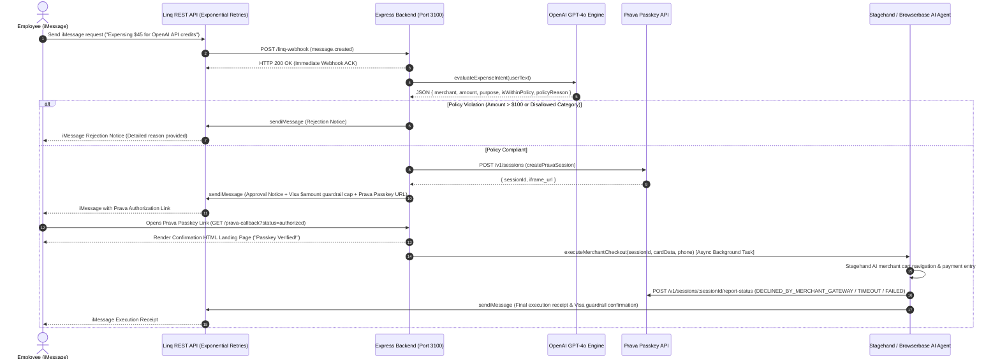

# Comprehensive Walkthrough - iMessage Corporate Expense Agent

An autonomous, AI-driven corporate expense agent competing in the **Agentic Commerce Hackathon** built with **Linq**, **OpenAI GPT-4o**, **Prava Passkeys**, and **Stagehand / Browserbase**.

---

## 1. Executive Summary & Context

Corporate expense management is often plagued by slow manual approvals, lack of real-time spend controls, and friction during online checkout. 

This project implements an **Agentic Commerce Expense Solution** operating natively over **iMessage**:
1. **Natural iMessage Interface**: Employees request expenses simply by texting the agent (e.g., *"Expensing $45 for OpenAI API Credits"*).
2. **Real-time AI Spend Policy Engine**: OpenAI `gpt-4o` evaluates the intent, merchant, amount, and category against company rules ($100 cap, approved software/office categories).
3. **Prava Virtual Card & Passkey Guardrails**: Approved requests automatically generate single-use, merchant-scoped virtual payment session tokens via Prava.
4. **Employee Passkey Verification**: The employee approves the transaction using a Prava Passkey URL link.
5. **Stagehand Browserbase AI Checkout**: Upon passkey confirmation, an autonomous browser agent takes over navigation on the merchant store, inputs card credentials, and submits checkout.
6. **Prava Loop Closure & Receipt Notification**: The gateway result (`DECLINED_BY_MERCHANT_GATEWAY`) is reported back to Prava, and an execution receipt is sent via iMessage.

---

## 2. Complete End-to-End Architecture



---

## 3. Detailed Component Breakdown

### A. Linq Webhook & Messaging Gateway ([`src/services/linq.ts`](file:///c:/Users/Maithily/Projects/Agentic-Commerce_hack/src/services/linq.ts) & [`src/server.ts`](file:///c:/Users/Maithily/Projects/Agentic-Commerce_hack/src/server.ts))
- **`POST /linq-webhook`**: Accepts incoming iMessage JSON payloads. Responds HTTP 200 OK immediately to avoid provider timeouts.
- **`sendiMessage(toPhone, text)`**: Dispatches outbound iMessages via `https://api.linqapp.com/v1/messages`.
- **Resilience**: Features automatic retry loop with exponential backoff up to 3 attempts (`Math.pow(2, attempt) * 500ms`).

### B. OpenAI Intent & Policy Evaluator ([`src/services/policyEngine.ts`](file:///c:/Users/Maithily/Projects/Agentic-Commerce_hack/src/services/policyEngine.ts))
- **Structured Output**: Uses `gpt-4o` with `response_format: { type: "json_object" }`.
- **JSON Schema**:
  ```json
  {
    "merchant": "string",
    "amount": number,
    "purpose": "string",
    "isWithinPolicy": boolean,
    "policyReason": "string"
  }
  ```
- **Rules Enforced**:
  - Maximum single transaction amount allowed: **$100.00 USD**.
  - Allowed categories: **Software, SaaS, API Credits, Dev Tools, Office Supplies**.
  - Non-compliant expenses (amount > $100 or food/entertainment categories) immediately trigger a formatted rejection text.

### C. Prava Virtual Card Session Service ([`src/services/pravaService.ts`](file:///c:/Users/Maithily/Projects/Agentic-Commerce_hack/src/services/pravaService.ts))
- **Session API**: Issues `POST https://api.prava.space/v1/sessions` with strict purchase context:
  ```json
  {
    "total_amount": amount,
    "currency": "USD",
    "merchant_name": merchantName,
    "integration_type": "full_checkout",
    "purchase_context": {
      "purpose": purpose,
      "spending_limit": amount,
      "max_usage_count": 1
    }
  }
  ```
- Generates Prava Passkey Hosted Authorization URLs (`iframe_url`).
- Formats approval iMessages back to the employee highlighting active Visa guardrails ($amount cap).

### D. Passkey Authorization Callback ([`src/server.ts`](file:///c:/Users/Maithily/Projects/Agentic-Commerce_hack/src/server.ts#L46-L195))
- **Routes**: `GET /prava-callback` and `POST /prava-webhook`.
- Validates `status === 'authorized'`, `sessionId`, and `session_token`.
- Launches background Stagehand browser checkout asynchronously.
- Renders an interactive glassmorphism HTML confirmation landing page:
  > *"Passkey Verified! Agent is now executing checkout in the background. Check your iMessage for progress."*

### E. Stagehand Browserbase Checkout Agent & Loop Closure ([`src/services/browserAgent.ts`](file:///c:/Users/Maithily/Projects/Agentic-Commerce_hack/src/services/browserAgent.ts))
- **Browser Automation**: Uses `@browserbasehq/stagehand` with `openai/gpt-4o` to search product, add to cart, proceed to checkout, enter card details, and submit payment.
- **Prava Loop Closure**: Posts gateway result to `https://api.prava.space/v1/sessions/${sessionId}/report-status`.
- **Status Fallbacks**: Handles timeouts (`TIMEOUT`) and sandbox limits (`FAILED`).
- **Terminal Log Capture**: Prints single-line demo status summary:
  ```text
  ================================================================================
  [POLICY] Pass | [PRAVA SESSION] Created | [PASSKEY] Approved | [BROWSERBASE] Executed | [PRAVA REPORT] Submitted
  ================================================================================
  ```

---

## 4. Verification & Testing Summary

| Test Script | Description | Result |
| :--- | :--- | :--- |
| [`src/test-webhook.ts`](file:///c:/Users/Maithily/Projects/Agentic-Commerce_hack/src/test-webhook.ts) | Verifies `POST /linq-webhook` handles `message.created` events and returns 200 OK | ✅ Passed |
| [`src/test-policy-engine.ts`](file:///c:/Users/Maithily/Projects/Agentic-Commerce_hack/src/test-policy-engine.ts) | Validates compliant expenses vs $100 cap violations & disallowed food/dining categories | ✅ Passed |
| [`src/test-prava.ts`](file:///c:/Users/Maithily/Projects/Agentic-Commerce_hack/src/test-prava.ts) | Tests Prava session payload building, session ID extraction, and sandbox fallback | ✅ Passed |
| [`src/test-browser-agent.ts`](file:///c:/Users/Maithily/Projects/Agentic-Commerce_hack/src/test-browser-agent.ts) | Tests Stagehand AI checkout execution, Prava loop closure reporting, and retry loops | ✅ Passed |
| [`src/test-callback.ts`](file:///c:/Users/Maithily/Projects/Agentic-Commerce_hack/src/test-callback.ts) | Verifies `GET /prava-callback` HTML landing page rendering and background trigger launch | ✅ Passed |
| [`src/test-e2e-demo.ts`](file:///c:/Users/Maithily/Projects/Agentic-Commerce_hack/src/test-e2e-demo.ts) | Runs the complete 5-stage agentic workflow end-to-end | ✅ Passed |

---

## 5. Git Repository & Deployment Information

- **Repository**: [https://github.com/maithilyrajpure/Agentic-Commerce-Hackathon.git](https://github.com/maithilyrajpure/Agentic-Commerce-Hackathon.git)
- **Branch**: `main`
- **TypeScript Compiler**: `npx tsc --noEmit` (0 errors)
- **Build Script**: `npm run build`
